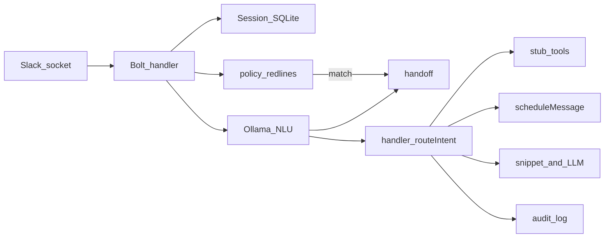

# Greens Health — AI Receptionist (Slack prototype)

Demo-quality Slack bot for care coordination: intent classification with confidence, threaded session memory, scheduled reminders via `chat.scheduleMessage`, human handoff packages, **Sully-style receptionist stubs** (insurance, appointment change, patient comm drafts, care navigation, pre-visit intake), **clinic-rules slot hints** (primary + alternates), **policy red-line** short-circuit to handoff, **SQLite audit lines** with a PHI heuristic flag, and stubbed tool calls (no real EHR/calendar/payer APIs).

## Operability (local + cloud)

This project is designed to run in two practical modes:

- **Local mode (development):** run on your machine with local Ollama (`OLLAMA_HOST=http://127.0.0.1:11434`) using `make dev` or `npm run dev`.
- **Cloud mode (shared use):** deploy to Render so teammates can use the Slackbot without your laptop running. Render setup assets are included in this repo (`render.yaml`, `.env.production.example`, and `docs/render-deployment.md`).

In both modes, the same bot logic is used; only runtime environment and secrets change.

## What this demonstrates

| Requirement | How it shows up |
|-------------|-----------------|
| Intents (NLU) | `schedule_inquiry`, `reminder_trigger`, `faq`, `task_routing`, `human_escalation`, plus `insurance_eligibility_check`, `appointment_change`, `patient_comm_draft`, `care_navigation`, `pre_visit_intake` ([`src/intents.ts`](src/intents.ts)) |
| Session memory | SQLite-backed turns keyed by `userId` + parent thread ts ([`src/sessionStore.ts`](src/sessionStore.ts)); optional `appointment_flow` / `intake_flow` for multi-turn flows |
| Availability hints | [`config/clinic-hours.sample.json`](config/clinic-hours.sample.json) + [`src/availability.ts`](src/availability.ts) — **read-only** primary + alternate slot text for schedule replies |
| Scheduled reminder | Persistent job row + Slack `scheduled_message_id` ([`src/scheduler.ts`](src/scheduler.ts)) |
| Escalation context | Summary, entities, suggested action, thread link ([`src/escalation.ts`](src/escalation.ts)); **policy redlines** from [`config/policy-redlines.json`](config/policy-redlines.json) ([`src/policyRedlines.ts`](src/policyRedlines.ts)) |
| Audit trail (demo) | `audit_log` table + JSON stdout lines ([`src/auditLog.ts`](src/auditLog.ts)); `phi_flag` via [`src/phiHeuristic.ts`](src/phiHeuristic.ts) — **not** a HIPAA attestation |
| Tool use | Stubs in [`src/tools.ts`](src/tools.ts); router in [`src/handler.ts`](src/handler.ts) |
| Voice (optional) | Audio → **local** [`scripts/transcribe_faster_whisper.py`](scripts/transcribe_faster_whisper.py) via `FASTER_WHISPER_PYTHON`, or **cloud** Whisper API; transcript → same NLU as text ([`src/voice/messageText.ts`](src/voice/messageText.ts)) |

## AI receptionist capabilities

The prototype receptionist supports the following thread-safe capabilities:

- **Schedule + alternatives:** shows open times, proposes primary + alternates from clinic config, supports booking confirmations.
- **Insurance eligibility check:** returns mock payer-style eligibility results (`insurance_eligibility_check`).
- **Appointment changes:** cancel, reschedule, and waitlist with multi-turn follow-up when details are missing.
- **Patient communication drafts:** creates SMS/email copy only (`patient_comm_draft`) and explicitly does not send.
- **Care navigation:** suggests which internal team should own a request (`care_navigation`).
- **Pre-visit intake:** guided meds → allergies → pharmacy capture, then bundle + EHR stub reference.
- **Slack reminders:** parses relative timing ("in 2 minutes") and schedules via `chat.scheduleMessage`.
- **FAQ responses:** returns in-repo snippets when available, or short LLM-generated answers.
- **Policy red-line safety:** crisis/policy phrases force immediate handoff and bypass normal routing.
- **Low confidence / human escalation:** unified handoff package with context, rationale, and suggested next action.

## Integration-first mode (API-like)

You can run the receptionist as a channel adapter + integration core:

- Slack remains the front door for coordinators.
- Core actions are centralized in [`src/core/actions.ts`](src/core/actions.ts).
- Providers are selected via registry in [`src/integrations/registry.ts`](src/integrations/registry.ts).
- Current implementation ships with `INTEGRATION_PROVIDER=stub`, but provider contracts are defined in [`src/integrations/types.ts`](src/integrations/types.ts) so real adapters can be plugged in with minimal router changes.

Optional HTTP API server (for system-to-system calls):

- `GET /healthz`, `GET /readyz`
- `GET /availability`
- `POST /appointments/book`
- `POST /appointments/change`
- `POST /eligibility/check`
- `POST /intake/submit`
- `POST /drafts/patient-message`

The server is implemented in [`src/apiServer.ts`](src/apiServer.ts) and is enabled with `API_SERVER_ENABLED=1`.

For hosted deployment (recommended: Render + Socket Mode), use:

- [`render.yaml`](render.yaml) for service blueprint
- [`.env.production.example`](.env.production.example) for production env baseline
- [`docs/render-deployment.md`](docs/render-deployment.md) for step-by-step setup
- [`docs/slack-smoke-checklist.md`](docs/slack-smoke-checklist.md) for workspace verification
- [`docs/ops-hardening-checklist.md`](docs/ops-hardening-checklist.md) for alerts, token rotation, and on-call ownership

LLM provider behavior:

- If `GEMINI_API_KEY` is set, the app uses Gemini first (`GEMINI_MODEL` / `GEMINI_API_BASE`).
- If Gemini fails at runtime, calls automatically fall back to Ollama (`OLLAMA_HOST` / `OLLAMA_MODEL`).

## Continuation plan (demo -> real scenarios via API)

Use this phased plan to move from prototype to real Greens workflows while keeping risk low.

### Phase 0: Keep demo behavior, add observability (week 0-1)

- Run with `INTEGRATION_PROVIDER=stub` and `API_SERVER_ENABLED=1`.
- Validate API health endpoints (`/healthz`, `/readyz`) from Greens infrastructure.
- Confirm audit + metrics ingestion from `receptionist_audit` and `receptionist_metric` logs.

### Phase 1: Shadow mode in one clinic (week 1-2)

- Enable `PILOT_MODE=shadow` so mutating actions return shadow IDs and do not write live systems.
- Have coordinators use Slack as usual; compare bot suggestions vs human actions.
- Track mismatch categories (intent, slot matching, policy escalation, eligibility details).

### Phase 2: Wire real read-path integrations (week 2-3)

- Implement provider adapters in `src/integrations/` and register in `src/integrations/registry.ts`.
- Start with read-only/high-confidence endpoints:
  - `GET /availability` backed by real calendar blocks
  - `POST /eligibility/check` backed by payer sandbox
- Keep write operations (`book`, `change`, `intake submit`) in shadow mode.

### Phase 3: Progressive write activation (week 3-5)

- Turn on write paths one by one with feature flags:
  1. `FEATURE_BOOKING=1`
  2. `FEATURE_APPOINTMENT_CHANGE=1`
  3. `FEATURE_INTAKE_SUBMIT=1`
- Keep idempotency required for all mutating API requests (`Idempotency-Key`).
- Monitor outbox drain and retry/circuit behavior for each integration.

### Phase 4: Multi-system production rollout (week 5+)

- Expand to additional clinics/teams after stable error and handoff rates.
- Move secrets to managed secret store, keep `API_SERVER_AUTH_TOKEN` mandatory.
- Add provider contract tests per adapter and replay tests using anonymized real conversations.

### Real scenario mapping (what to integrate first)

- **Scheduling ops:** map `/availability` + `/appointments/book|change` to calendar/EHR scheduler.
- **Front-desk insurance:** map `/eligibility/check` to payer clearinghouse API.
- **Care coordination intake:** map `/intake/submit` to EHR intake/note endpoint.
- **Patient comms workflow:** keep `/drafts/patient-message` copy-only first, then add approved sender workflow outside bot.
- **Escalations:** send handoff payloads to Greens triage queue/ticketing system.

### Minimal production checklist

- API auth token enabled, TLS termination in front of API server.
- `REDACT_LOGS=1` and log sink retention policy reviewed.
- Feature flags defined per clinic/tenant.
- Runbook in [`docs/integration-runbook.md`](docs/integration-runbook.md) adopted by on-call + ops.

## Sully-style demo narrative (prototype / stub)

Use this thread script to mirror a **receptionist surface** similar in spirit to [Sully.ai — AI Receptionist](https://www.sully.ai/agents/receptionist). Everything below is **stubbed or copy-only**; say so out loud in demos.

1. **Schedule + alternatives** — Ask for slots; bot returns a hold id, **primary** slot, and **alternates** from clinic config.
2. **Insurance** — Ask to verify eligibility; bot returns a mock payer-style line (`insurance_eligibility_check`).
3. **Reschedule / cancel / waitlist** — Use `appointment_change`; if details are missing, bot walks **multi-turn** questions, then returns a stub change or waitlist id.
4. **Draft patient SMS/email** — Ask for a reminder or directions text; bot returns **draft only** (`patient_comm_draft` — nothing is sent).
5. **Care navigation** — Ask who should own a question; bot returns a **stub routing** suggestion (`care_navigation`).
6. **Pre-visit intake** — Trigger `pre_visit_intake`; answer meds → allergies → pharmacy; bot returns bundle + EHR **stub** refs.
7. **Slack reminder** — “in 2 minutes” style → `chat.scheduleMessage`.
8. **FAQ** — Snippet or short Ollama answer.
9. **Policy red line** — A message matching configured patterns (e.g. crisis-style phrases) → **forced handoff** without running normal routing.
10. **Low confidence / human** — Same handoff path as before.

**Non-goals:** no PHI-grade compliance review, no real calendar/EHR/payer/SMS, API keys via env only.

## Quick start

1. Install [Ollama](https://ollama.com) and pull the model:

```bash
ollama pull llama3.2:latest
ollama serve   # if not already running
```

2. Configure Slack + optional overrides in `.env`:

```bash
cp .env.example .env
# Fill Slack vars; Ollama defaults to http://127.0.0.1:11434 and llama3.2:latest
npm install
npm run dev
```

Or start **Ollama + optional Whisper venv check + bot** in one step (requires `make` and `curl`):

```bash
make dev
```

See `make help` for `pull`, `ollama-up`, and `whisper-check`.

Production-ish run after build:

```bash
npm run build
npm start
```

### Local vs Render at a glance

- **Run locally with Ollama:**
  - Start Ollama (`ollama serve`)
  - Keep `OLLAMA_HOST` as localhost
  - Use `make dev`
- **Run in Render cloud:**
  - Deploy from this repo (recommended via `render.yaml`)
  - Set production env vars from `.env.production.example`
  - Use Render logs/health checks + Slack smoke checklist for verification

### Slack app setup (summary)

1. Create a Slack app; enable **Socket Mode**; generate **App-Level Token** with `connections:write`.
2. **Bot Token Scopes:** `chat:write`, `channels:history`, `groups:history`, `im:history`, `mpim:history`, `app_mentions:read`, `users:read` (adjust to your channels). For **voice/audio messages**, add **`files:read`** so the bot can download clips from `url_private`.
3. **Voice (optional):** **Local (no API bill):** install **ffmpeg**, create a Python venv with `pip install faster-whisper`, set **`FASTER_WHISPER_PYTHON`** to that venv’s `python3` (see [`.env.example`](.env.example)). The bot runs [`scripts/transcribe_faster_whisper.py`](scripts/transcribe_faster_whisper.py). **Cloud fallback:** set `WHISPER_API_KEY` or `OPENAI_API_KEY` — used if local is unset or fails. NLU stays **Ollama**; only STT uses Python or the Whisper HTTP API.
4. Subscribe to **`message.channels`** (and/or groups/IM as needed) under **Event Subscriptions** — not required for Socket Mode event delivery beyond installing the app.
5. Install the app to your workspace; invite the bot to the demo channel.

## Metrics (automated &lt; 30s story)

Structured logs to stdout for each handled message:

```json
{"type":"receptionist_metric","session_key":"U…123:1234567890.123456","intent":"faq","confidence":0.82,"started_at":"…","replied_at":"…","latency_ms":420,"path":"automated","manual_baseline_minutes":"5-10","automated_target_seconds":30}
```

`path` may be `policy_escalation` when a policy redline matched. Compare `latency_ms` to a manual 5–10 minute baseline during the demo narrative.

**Audit sample** (also persisted in SQLite `audit_log` when the DB is used):

```json
{"type":"receptionist_audit","session_key":"…","user_id":"…","intent":"schedule_inquiry","confidence":0.88,"path":"automated","phi_flag":false,"action_summary":"routed:schedule_inquiry","text_preview":"…"}
```

## Regression (classifier)

With Ollama running and the model available:

```bash
npm run regression
```

Prints intent/confidence for every golden phrase in [`src/intents.ts`](src/intents.ts) and counts mismatches.

## Automated tests (Vitest)

**Fast suite (no LLM):** deterministic checks for reminder parsing, handoff formatting, stub tools, SQLite session memory, availability, policy/PHI helpers, appointment + intake flows, audit insert.

```bash
npm test
```

**Capabilities + LLM-as-judge:** runs a large scenario suite in [`tests/nlu.judge.test.ts`](tests/nlu.judge.test.ts), where each scenario executes receptionist functionality and sends the **actual output** to a second Ollama judge ([`tests/support/llmJudge.ts`](tests/support/llmJudge.ts)).

Coverage is **30 judged scenarios** (3 each) across:

- schedule alternatives
- insurance eligibility
- reschedule/cancel/waitlist
- patient SMS/email draft
- care navigation
- pre-visit intake
- Slack reminders
- FAQ behavior
- policy red-line handoff
- low-confidence/human handoff

Requires Ollama running; uses `JUDGE_MODEL` when set (otherwise falls back to `OLLAMA_MODEL`).

```bash
npm run test:llm
```

After judge scenarios, a short summary is printed to stdout. Use `npm run test:watch` for interactive runs.

## Architecture



## Connector model (plug-in your systems)

To integrate Greens systems, implement the provider interfaces in [`src/integrations/types.ts`](src/integrations/types.ts):

- `CalendarProvider` (availability + booking/change)
- `EligibilityProvider`
- `PatientMessagingProvider`
- `CareNavigationProvider`
- `TaskRoutingProvider`
- `EhrProvider` (intake submit)

Then:

1. Add your provider implementation under `src/integrations/`.
2. Register it in [`src/integrations/registry.ts`](src/integrations/registry.ts).
3. Set `INTEGRATION_PROVIDER=<your-provider>` in env.
4. Run the existing tests + add provider contract tests for your adapter.

Reliability + safety primitives included:

- idempotency store (`idempotency_keys`) via [`src/integrations/idempotency.ts`](src/integrations/idempotency.ts)
- retry/circuit logic via [`src/integrations/reliability.ts`](src/integrations/reliability.ts)
- integration outbox (`integration_outbox`) via [`src/integrations/outbox.ts`](src/integrations/outbox.ts)
- log redaction helpers via [`src/security.ts`](src/security.ts)

Operational onboarding + staged rollout guidance is in [`docs/integration-runbook.md`](docs/integration-runbook.md).
Hosted storage options are documented in [`docs/storage-strategy.md`](docs/storage-strategy.md).

## Environment

See [`.env.example`](.env.example). Notable optional keys:

- `CLINIC_HOURS_PATH` — JSON file for slot hints (default: `./config/clinic-hours.sample.json`).
- `POLICY_REDLINES_PATH` — JSON with `patterns` (forced handoff) and `phi_audit_patterns` (audit flag only).
- `INTEGRATION_PROVIDER` — provider registry selector (default: `stub`).
- `API_SERVER_ENABLED`, `API_SERVER_PORT`, `API_SERVER_AUTH_TOKEN` — API mode controls.
- `INTEGRATION_MAX_RETRIES`, `INTEGRATION_RETRY_BASE_MS`, `INTEGRATION_CIRCUIT_FAILURES`, `INTEGRATION_CIRCUIT_OPEN_MS` — provider reliability controls.
- `PILOT_MODE` + `FEATURE_*` flags — staged rollout toggles.
- `REDACT_LOGS` — redact sensitive patterns in logs/audit previews.

## License

Proprietary demo — Greens Health internal use.
