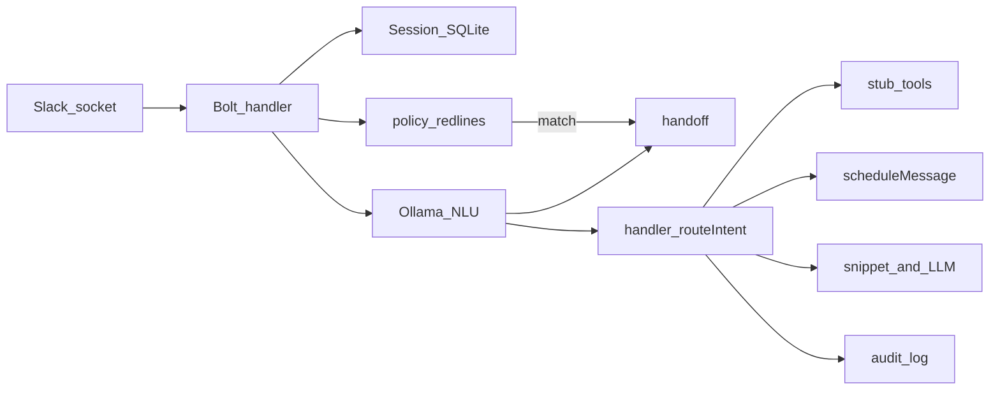

# Greens Health — AI Receptionist (Slack prototype)

Demo-quality Slack bot for care coordination: intent classification with confidence, threaded session memory, scheduled reminders via `chat.scheduleMessage`, human handoff packages, **Sully-style receptionist stubs** (insurance, appointment change, patient comm drafts, care navigation, pre-visit intake), **clinic-rules slot hints** (primary + alternates), **policy red-line** short-circuit to handoff, **SQLite audit lines** with a PHI heuristic flag, and stubbed tool calls (no real EHR/calendar/payer APIs).

## What this demonstrates

| Requirement | How it shows up |
|-------------|-----------------|
| Intents (NLU) | `schedule_inquiry`, `reminder_trigger`, `faq`, `task_routing`, `human_escalation`, plus `insurance_eligibility_check`, `appointment_change`, `patient_comm_draft`, `care_navigation`, `pre_visit_intake` ([`src/intents.ts`](src/intents.ts)) |
| Session memory | SQLite-backed turns keyed by `userId` + parent thread ts ([`src/sessionStore.ts`](src/sessionStore.ts)); optional `appointment_flow` / `intake_flow` for multi-turn flows |
| Availability hints | [`config/clinic-hours.sample.json`](config/clinic-hours.sample.json) + [`src/availability.ts`](src/availability.ts) — **read-only** primary + alternate slot text for schedule replies |
| Scheduled reminder | Persistent job row + Slack `scheduled_message_id` ([`src/scheduler.ts`](src/scheduler.ts)) |
| Escalation context | Summary, entities, suggested action, thread link ([`src/escalation.ts`](src/escalation.ts)); **policy redlines** from [`config/policy-redlines.json`](config/policy-redlines.json) ([`src/policyRedlines.ts`](src/policyRedlines.ts)) |
| Audit trail (demo) | `audit_log` table + JSON stdout lines ([`src/auditLog.ts`](src/auditLog.ts)); `phi_flag` via [`src/phiHeuristic.ts`](src/phiHeuristic.ts) — **not** a HIPAA attestation |
| Tool use | Stubs in [`src/tools.ts`](src/tools.ts); router in [`src/handler.ts`](src/handler.ts) |
| Voice (optional) | Audio → **local** [`scripts/transcribe_faster_whisper.py`](scripts/transcribe_faster_whisper.py) via `FASTER_WHISPER_PYTHON`, or **cloud** Whisper API; transcript → same NLU as text ([`src/voice/messageText.ts`](src/voice/messageText.ts)) |

## Sully-style demo narrative (prototype / stub)

Use this thread script to mirror a **receptionist surface** similar in spirit to [Sully.ai — AI Receptionist](https://www.sully.ai/agents/receptionist). Everything below is **stubbed or copy-only**; say so out loud in demos.

1. **Schedule + alternatives** — Ask for slots; bot returns a hold id, **primary** slot, and **alternates** from clinic config.
2. **Insurance** — Ask to verify eligibility; bot returns a mock payer-style line (`insurance_eligibility_check`).
3. **Reschedule / cancel / waitlist** — Use `appointment_change`; if details are missing, bot walks **multi-turn** questions, then returns a stub change or waitlist id.
4. **Draft patient SMS/email** — Ask for a reminder or directions text; bot returns **draft only** (`patient_comm_draft` — nothing is sent).
5. **Care navigation** — Ask who should own a question; bot returns a **stub routing** suggestion (`care_navigation`).
6. **Pre-visit intake** — Trigger `pre_visit_intake`; answer meds → allergies → pharmacy; bot returns bundle + EHR **stub** refs.
7. **Slack reminder** — “in 2 minutes” style → `chat.scheduleMessage`.
8. **FAQ** — Snippet or short Ollama answer.
9. **Policy red line** — A message matching configured patterns (e.g. crisis-style phrases) → **forced handoff** without running normal routing.
10. **Low confidence / human** — Same handoff path as before.

**Non-goals:** no PHI-grade compliance review, no real calendar/EHR/payer/SMS, API keys via env only.

## Quick start

1. Install [Ollama](https://ollama.com) and pull the model:

```bash
ollama pull llama3.2:latest
ollama serve   # if not already running
```

2. Configure Slack + optional overrides in `.env`:

```bash
cp .env.example .env
# Fill Slack vars; Ollama defaults to http://127.0.0.1:11434 and llama3.2:latest
npm install
npm run dev
```

Or start **Ollama + optional Whisper venv check + bot** in one step (requires `make` and `curl`):

```bash
make dev
```

See `make help` for `pull`, `ollama-up`, and `whisper-check`.

Production-ish run after build:

```bash
npm run build
npm start
```

### Slack app setup (summary)

1. Create a Slack app; enable **Socket Mode**; generate **App-Level Token** with `connections:write`.
2. **Bot Token Scopes:** `chat:write`, `channels:history`, `groups:history`, `im:history`, `mpim:history`, `app_mentions:read`, `users:read` (adjust to your channels). For **voice/audio messages**, add **`files:read`** so the bot can download clips from `url_private`.
3. **Voice (optional):** **Local (no API bill):** install **ffmpeg**, create a Python venv with `pip install faster-whisper`, set **`FASTER_WHISPER_PYTHON`** to that venv’s `python3` (see [`.env.example`](.env.example)). The bot runs [`scripts/transcribe_faster_whisper.py`](scripts/transcribe_faster_whisper.py). **Cloud fallback:** set `WHISPER_API_KEY` or `OPENAI_API_KEY` — used if local is unset or fails. NLU stays **Ollama**; only STT uses Python or the Whisper HTTP API.
4. Subscribe to **`message.channels`** (and/or groups/IM as needed) under **Event Subscriptions** — not required for Socket Mode event delivery beyond installing the app.
5. Install the app to your workspace; invite the bot to the demo channel.

## Metrics (automated &lt; 30s story)

Structured logs to stdout for each handled message:

```json
{"type":"receptionist_metric","session_key":"U…123:1234567890.123456","intent":"faq","confidence":0.82,"started_at":"…","replied_at":"…","latency_ms":420,"path":"automated","manual_baseline_minutes":"5-10","automated_target_seconds":30}
```

`path` may be `policy_escalation` when a policy redline matched. Compare `latency_ms` to a manual 5–10 minute baseline during the demo narrative.

**Audit sample** (also persisted in SQLite `audit_log` when the DB is used):

```json
{"type":"receptionist_audit","session_key":"…","user_id":"…","intent":"schedule_inquiry","confidence":0.88,"path":"automated","phi_flag":false,"action_summary":"routed:schedule_inquiry","text_preview":"…"}
```

## Regression (classifier)

With Ollama running and the model available:

```bash
npm run regression
```

Prints intent/confidence for every golden phrase in [`src/intents.ts`](src/intents.ts) and counts mismatches.

## Automated tests (Vitest)

**Fast suite (no LLM):** deterministic checks for reminder parsing, handoff formatting, stub tools, SQLite session memory, availability, policy/PHI helpers, appointment + intake flows, audit insert.

```bash
npm test
```

**NLU + LLM-as-judge:** runs [`classifyTurn`](src/llm/classify.ts) on scenario messages, then a second Ollama call scores whether the JSON matches a written rubric ([`tests/support/llmJudge.ts`](tests/support/llmJudge.ts)). Requires Ollama running; uses `OLLAMA_MODEL` (classifier) and optional `JUDGE_MODEL` (defaults to the same).

```bash
npm run test:llm
```

After judge scenarios, a short summary is printed to stdout. Use `npm run test:watch` for interactive runs.

## Architecture



## Environment

See [`.env.example`](.env.example). Notable optional keys:

- `CLINIC_HOURS_PATH` — JSON file for slot hints (default: `./config/clinic-hours.sample.json`).
- `POLICY_REDLINES_PATH` — JSON with `patterns` (forced handoff) and `phi_audit_patterns` (audit flag only).

## License

Proprietary demo — Greens Health internal use.
